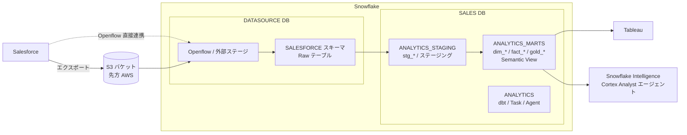

# fujitech_Snowflake_PoC

フジテック向け Snowflake PoC のリポジトリ。Salesforce の営業データを Snowflake に取り込み、
dbt でディメンショナルモデルに整形し、Tableau / Snowflake Intelligence（CoWork）から
利用できるようにするまでの環境構築コードと設計メモをまとめている。

## 全体像

## ディレクトリ構成

| パス | 内容 |
| --- | --- |
| `Snowflake/構成.md` | Snowflake 環境の設計メモ（DB/スキーマ、ロール、WH、Integration、取り込み方式など）。図付き |
| `Snowflake/sql/` | 環境構築用 DDL。`00` から順に実行する（下表参照） |
| `dbt_project/` | 営業パイプライン用 dbt プロジェクト（Databricks Lakeflow Declarative Pipelines を dbt-Snowflake に移植）。`stg_*`（ステージング）→ `dim_*` / `fact_*` / `gold_*`（マート）。詳細は `dbt_project/README.md` |
| `Snowflake検証向け：Flatpadデータパイプライン要件.pdf` | 先方から共有された要件資料 |

## Snowflake セットアップ SQL の実行順

| ファイル | 実行ロール | 概要 |
| --- | --- | --- |
| `00_accout_level_paramater.sql` | ACCOUNTADMIN | タイムゾーン JST 化、Cortex クロスリージョン設定、Time Travel（PoC ではコメントアウト） |
| `01_roles_and_warehouse.sql` | SECURITYADMIN / SYSADMIN / ACCOUNTADMIN | ロール階層、`SALES_WH`、リソースモニター `SALES_RM` |
| `02_databases_and_schemas.sql` | SYSADMIN | `DATASOURCE` / `SALES` DB とスキーマ、オーナーシップ移管 |
| `03_grants.sql` | 各 DB の `*_ADMIN` | アクセスロールへの権限付与（DB 単位で一律、Future Grants 併用） |
| `04_storage_integration_and_stage.sql` | ACCOUNTADMIN / DATASOURCE__RWM | S3 用 Storage Integration と外部ステージ（バケット名・IAM ロール ARN は先方提供待ち） |
| `05_salesforce_external_access.sql` | ACCOUNTADMIN / SYSADMIN / SECURITYADMIN | Openflow の Snowflake 側セットアップ: (A) Salesforce API 疎通（Network Rule / Secret / EAI）、(B) 管理/運用（人間）権限を既存の DATASOURCE ロール階層へ（構築 = `DATASOURCE_ADMIN`、運用 + UI ログイン = `DATASOURCE_MANAGER`）、(C) 取り込み専用 WH `OPENFLOW_WH` + RM `OPENFLOW_RM`、(D) ランタイム実行ロール `DATASOURCE_OPENFLOW`（サービスユーザー払い出し・アプリロール付与・プール名確定待ちの箇所あり） |
| `06_users.sql` | SECURITYADMIN | Tableau サービスユーザー（PAT 認証）、dbt サービスユーザー `SVC_DBT`、Openflow 接続サービスユーザー `SVC_OPENFLOW`（キーペア認証、`DATASOURCE_OPENFLOW`）、営業ユーザー（テンプレート） |
| `07_load_gold_opportunity_line_item_wide.sql` | SALES_MANAGER | dbt 移行前の暫定ロード SQL（`gold_opportunity_line_item_wide`） |
| `08_cowork_agents.sql` | SALES_ADMIN / ACCOUNTADMIN | CoWork（Snowflake Intelligence）エージェント・Semantic View の権限セットアップ |

`<TODO: ...>` プレースホルダは先方からの情報提供後に置換する。
Openflow を使う場合は 05 の TODO/コメントアウトを埋めたうえで、Openflow デプロイメントを
GUI で作成し、05 (B) 内の TODO（アプリロール `<app>.OPENFLOW_ADMIN` と コンピュートプール USAGE の
`DATASOURCE_MANAGER` への付与）まで実行する。UI ログインは `DATASOURCE_MANAGER`（構築時のみ `DATASOURCE_ADMIN`）。

## 進め方

1. `Snowflake/sql/` を順に実行して基盤を構築
2. S3 → 外部ステージ経由でデータを取り込み、`dbt_project/` の開発を先行
3. Openflow（ランタイム・連携先）の構築を並行
4. Task（DAG）で dbt 実行を自動化し、数値検証（人力）
5. Tableau 接続、Snowflake Intelligence（CoWork）エージェントを作成

現状の未確定事項・要検討事項は `Snowflake/構成.md` を参照。
