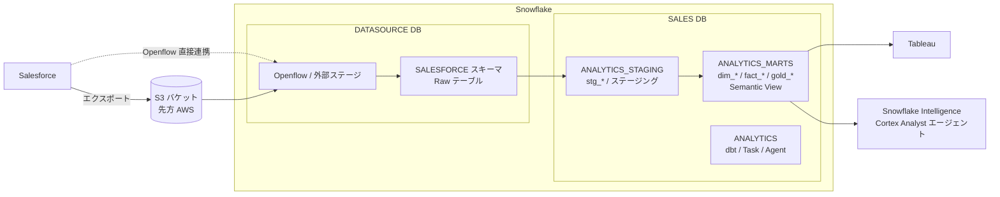

# fujitech_Snowflake_PoC

フジテック向け Snowflake PoC のリポジトリ。Salesforce の営業データを Snowflake に取り込み、
dbt でディメンショナルモデルに整形し、Tableau / Snowflake Intelligence（CoWork）から
利用できるようにするまでの環境構築コードと設計メモをまとめている。

## 全体像



## ディレクトリ構成

| パス | 内容 |
| --- | --- |
| `Snowflake/構成.md` | Snowflake 環境の設計メモ（DB/スキーマ、ロール、WH、Integration、取り込み方式など）。図付き |
| `Snowflake/sql/` | 環境構築用 DDL。`00` → `06` の順に実行する（下表参照） |
| `dbt_project/` | 営業パイプライン用 dbt プロジェクト（Databricks Lakeflow Declarative Pipelines を dbt-Snowflake に移植）。`stg_*`（ステージング）→ `dim_*` / `fact_*` / `gold_*`（マート）。詳細は `dbt_project/README.md` |
| `Snowflake検証向け：Flatpadデータパイプライン要件.pdf` | 先方から共有された要件資料 |

## 接続先

接続情報（アカウント・ユーザー・パスワード等）は **リポジトリ直下の `.env`** に置く。
`.env` は `.gitignore` 済みで GitHub には上がらない。

```bash
cp .env.example .env      # 値を埋める
set -a; source .env; set +a

# Snowflake CLI 接続名 fujitech（~/.snowflake/connections.toml の空スタブを .env が上書き）
snow sql -c fujitech -q "select current_account()"
snow sql -c fujitech -f Snowflake/sql/00_accout_level_paramater.sql
snow sql -c fujitech        # 対話セッション
```

dbt（`dbt_project/`）は `.env` の `DBT_SNOWFLAKE_USER` / `DBT_SNOWFLAKE_PASSWORD` を
`profiles.yml` の `env_var()` で参照する。詳細は `dbt_project/README.md`。

## Snowflake セットアップ SQL の実行順

| ファイル | 実行ロール | 概要 |
| --- | --- | --- |
| `00_accout_level_paramater.sql` | ACCOUNTADMIN | タイムゾーン JST 化、Cortex クロスリージョン設定、Time Travel（PoC ではコメントアウト） |
| `01_roles_and_warehouse.sql` | SECURITYADMIN / SYSADMIN / ACCOUNTADMIN | ロール階層、`SALES_WH`、リソースモニター `SALES_RM` |
| `02_databases_and_schemas.sql` | SYSADMIN | `DATASOURCE` / `SALES` DB とスキーマ、オーナーシップ移管 |
| `03_grants.sql` | 各 DB の `*_ADMIN` | アクセスロールへの権限付与（DB 単位で一律、Future Grants 併用） |
| `04_storage_integration_and_stage.sql` | ACCOUNTADMIN / DATASOURCE__RWM | S3 用 Storage Integration と外部ステージ（バケット名・IAM ロール ARN は先方提供待ち） |
| `05_salesforce_external_access.sql` | ACCOUNTADMIN | Openflow → Salesforce API 疎通用の Network Rule / External Access Integration（サービスユーザー払い出し待ち） |
| `06_users.sql` | SECURITYADMIN | Tableau サービスユーザー（PAT 認証）、営業ユーザー（テンプレート） |

`<TODO: ...>` プレースホルダは先方からの情報提供後に置換する。

## 進め方

1. `Snowflake/sql/` を順に実行して基盤を構築
2. S3 → 外部ステージ経由でデータを取り込み、`dbt_project/` の開発を先行
3. Openflow（ランタイム・連携先）の構築を並行
4. Task（DAG）で dbt 実行を自動化し、数値検証（人力）
5. Tableau 接続、Snowflake Intelligence（CoWork）エージェントを作成

現状の未確定事項・要検討事項は `Snowflake/構成.md` を参照。
