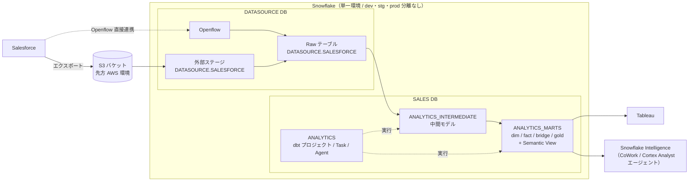
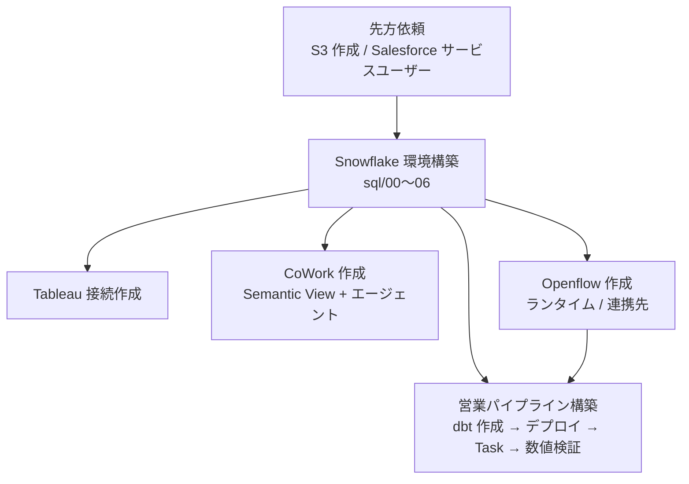
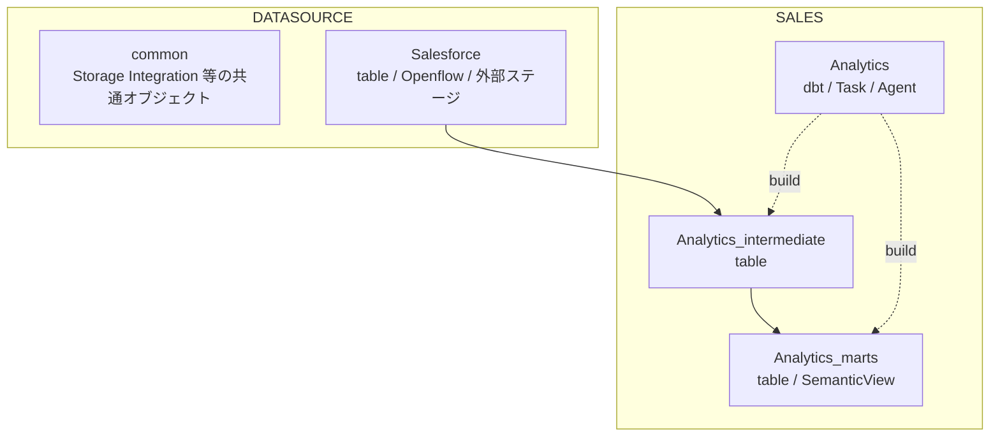
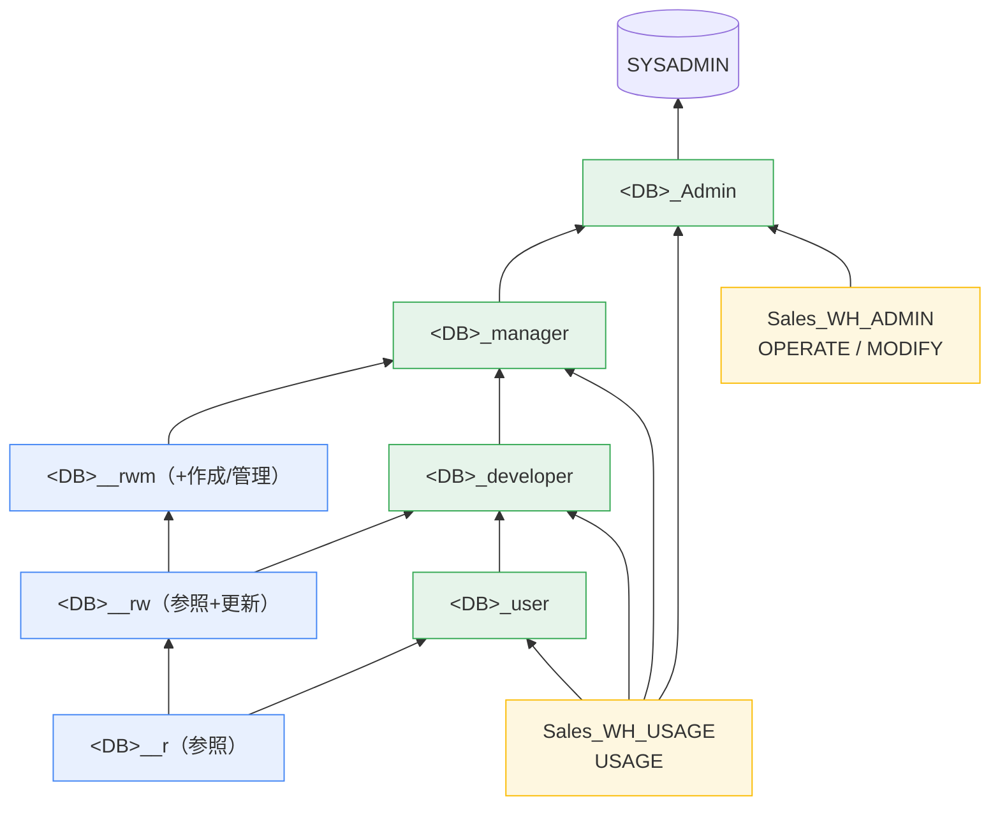
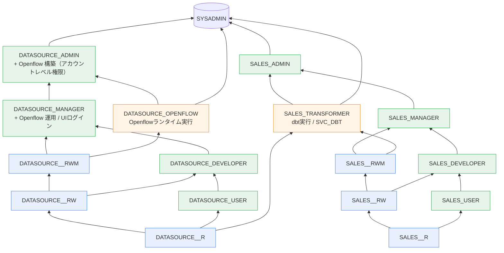
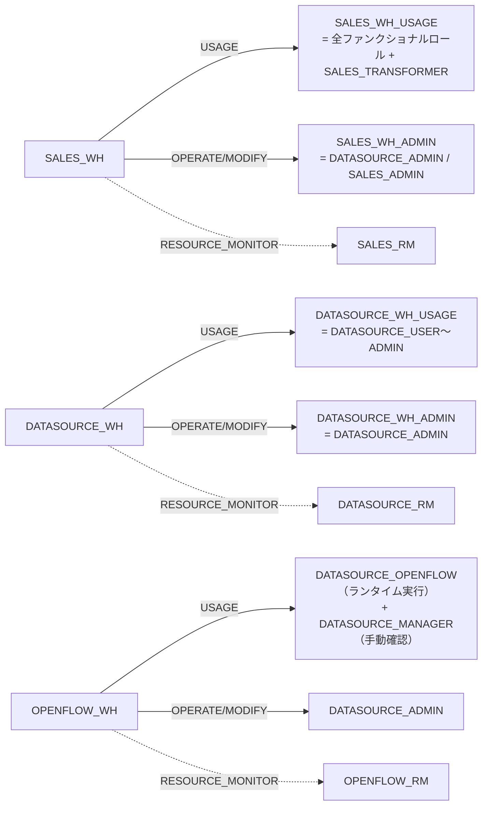
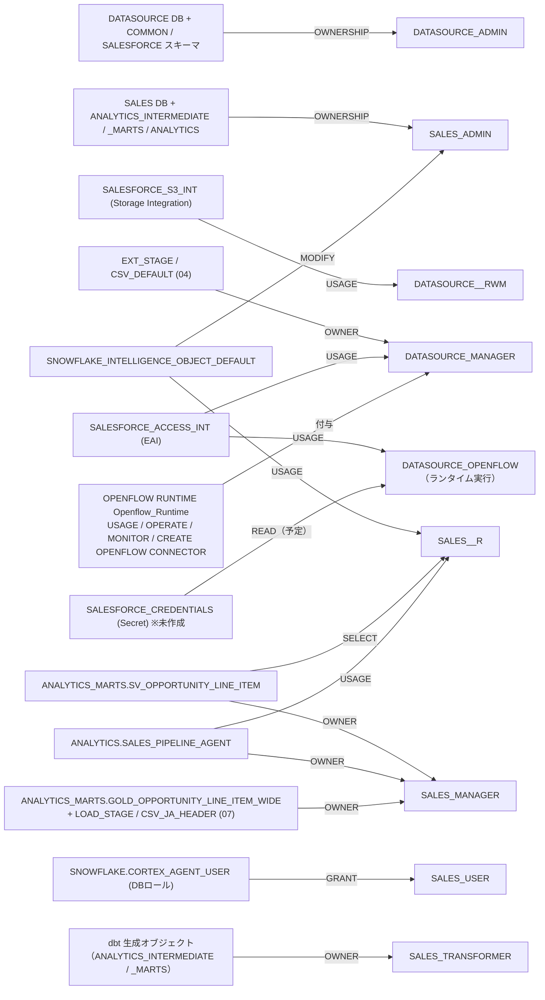
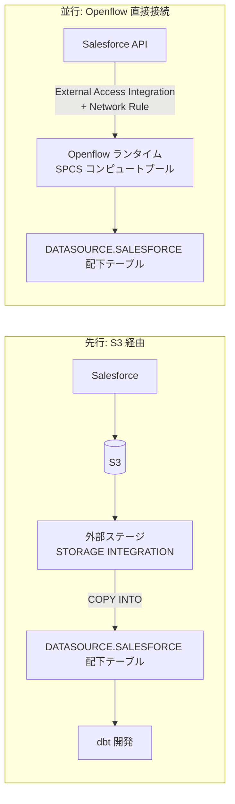
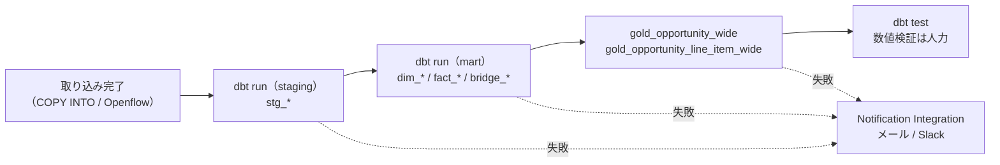
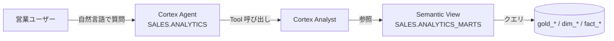

# Snowflake PoC 構成メモ

## 全体アーキテクチャ

主なワークストリーム:

## やること
- Snowflakeの環境構築
- 営業パイプライン構築
    - dbt作成
    - デプロイ
    - タスク作成
    - 数値検証
- Tableau接続作成
- CoWork作成
- Openflow作成
    - ランタイム作成
    - 連携先作成

## 先方への依頼
- S3作成（先方AWS環境）
- Salesforceサービスユーザー設定

### Snowflake環境構築
#### DB配下

- Datasource
    - common
    - Salesforce
        - table
        - Openflow
        - 外部ステージ
- Sales
    - Analytics_marts
        - table
        - SemanticView
    - Analytics_intermediate
        - table
    - Analytics 
        - dbt
        - Task
        - Agent

#### アカウントレベルオブジェクト
- WH
    - Sales_WH（dbt実行、営業ユーザー、Tableau共通）
    - Datasource_WH（S3 COPY等のアドホック取り込み）
    - Openflow_WH（Openflow の Salesforce CDC 定常負荷専用。アドホックと分離）
- RM
    - Sales_RM / Datasource_RM / Openflow_RM
        - クレジット上限・アラート通知先（Notification Integration）は要設定
- Integration
    - Storage Integration（S3用、IAMロール・外部ID）※Datasource/common用
        - 未実装・要検討
    - External Access Integration / Network Rule（Salesforce API疎通用）※Datasource/Salesforce用
        - 未実装・要検討
    - Notification Integration（WHアラート通知、タスク失敗時の通知先（メール/Slack等）に使用）→ 要設定
- Role

アクセスロール（`__r ⊂ __rw ⊂ __rwm`）をファンクショナルロールにぶら下げ、ファンクショナルロールは
`user → developer → manager → Admin` の順に内包する。DATASOURCE / SALES の2系統を同じ形で作成。

    - Adminロールに他のファンクショナルロールはぶら下げる
    - WHのUSE権限は全ファンクショナルロールにつけるが、Manage権限はAdminだけ
    - アクセスロール
        - <DB>__r
        - <DB>__rw
        - <DB>__rwm
    - ファンクショナルロール
        - <DB>_Admin
        - <DB>_manager
        - <DB>_developer
        - <DB>_user
    - WHのロール
    - Future Grants：GRANT ... ON FUTUREでスキーマ単位に自動付与
    - アクセス範囲：スキーマ単位では分けず、DB単位で一律付与
    - Openflow（SPCSコンピュートプール、Datasource/Salesforce配下オブジェクト）のオーナーシップは既存の<DB>_Adminロールに持たせる
    - Openflow の 管理/運用（人間）は既存の DATASOURCE ロール階層に寄せ、ランタイム実行だけ専用ロール（05_salesforce_external_access.sql）:
        - `DATASOURCE_ADMIN` … 構築系。デプロイメント作成/アップグレードに必要なアカウントレベル権限（`CREATE COMPUTE POOL` / `CREATE INTEGRATION` / `BIND SERVICE ENDPOINT` / `CREATE APPLICATION` / `MANAGE GRANTS` 等）。実質アカウント管理者級に格上げされる点に注意（SYSADMIN にも継承）。許容できなければ初回のみ付与→完了後 REVOKE
        - `DATASOURCE_MANAGER` … 運用系（コネクタ操作・キャンバス編集・ログ確認）＋ UI ログイン。`SALESFORCE_ACCESS_INT` USAGE（UI でランタイムに割当）/ `OPENFLOW_WH` USAGE（手動確認）/ アプリロール `<app>.OPENFLOW_ADMIN`
        - `DATASOURCE_OPENFLOW` … ランタイム実行ロール（作成時に「実行ロール」として指定）。ランタイムのプロセスがこのロールでデータ操作。人間はログインに使わない。`DATASOURCE__RWM` 継承（DATASOURCE.SALESFORCE 書き込み・宛先テーブル自動作成）＋ `SALESFORCE_ACCESS_INT` USAGE ＋ `SALESFORCE_CREDENTIALS` READ ＋ `OPENFLOW_WH` USAGE ＋ コンピュートプール USAGE。dbt 側の `SALES_TRANSFORMER` と対
        - UI ログインは `DATASOURCE_MANAGER`（構築時のみ `DATASOURCE_ADMIN`）。ACCOUNTADMIN/SECURITYADMIN/ORGADMIN は OAuth で既定ブロックされ UI ログイン不可。ログインに使うのは各ユーザーの `DEFAULT_ROLE`
        - ランタイムオブジェクト `Openflow_Runtime`（対象スキーマ DATASOURCE.SALESFORCE）の Manage access は UI で設定済み。USAGE / OPERATE / MONITOR / USAGE ON SCHEMA / CREATE OPENFLOW CONNECTOR ON SCHEMA / USAGE ON DATABASE をすべて `DATASOURCE_MANAGER` のみに付与
- User
    - Tableauサービスユーザー
        - 認証方式はPAT
    - 営業ユーザー（人を想定）
- ネットワークポリシー（IP制限）、SSO/SAML連携 → 一旦パス（PoCのため）

#### ロールとオブジェクトのマッピング（現状の sql/01〜08）

ロール階層（矢印 = grant されて上位が内包）:

ウェアハウス ↔ ロール:

名前付きオブジェクト ↔ ロール（所有 / 権限）:

ユーザー:

| ユーザー | 種別 | DEFAULT_ROLE | DEFAULT_WH | 認証 |
| --- | --- | --- | --- | --- |
| `SVC_TABLEAU` | SERVICE | `SALES_USER` | `SALES_WH` | PAT（`NETWORK_POLICY = TABLEAU_PAT_NP`） |
| `SVC_DBT` | SERVICE | `SALES_TRANSFORMER` | `SALES_WH` | キーペア推奨 |
| `SVC_OPENFLOW` | SERVICE | `DATASOURCE_OPENFLOW` | `OPENFLOW_WH` | RSA キーペア（NP 不要） |
| 営業ユーザー（人・テンプレ） | PERSON | `SALES_USER` | `SALES_WH` | — |
| Openflow 担当（人） | PERSON | `DATASOURCE_MANAGER`（構築時 `DATASOURCE_ADMIN`） | — | Snowflake OAuth（UI ログイン） |

※ Openflow ランタイムの実行ロールは `DATASOURCE_OPENFLOW`。Salesforce コネクタが Snowflake へ書き込む接続ユーザー `SVC_OPENFLOW` も同じロールにして権限を1本化（06_users.sql）。

#### 環境
- dev/staging/prod分離はせず、単一環境で運用

#### データ取り込み

- S3経由とOpenflow直接接続の両方を使う
    - まずS3から外部ステージ経由でデータを取り込み、dbt開発を先行して進める
    - Openflowの構築（ランタイム・連携先）は並行して進める
- 未実装・要検討
    - 外部ステージのファイルフォーマット定義 → 実ファイルを見て作成
    - 自動取り込み方式 → 一旦COPY INTO（Snowpipe等は後で検討）
    - Openflowランタイム用SPCSコンピュートプール → GUIで作成

#### 個人情報保護
- マスキングポリシー等の対応は不要（対象データに個人情報を含まない前提）

#### タスク/監視

- タスクの依存関係（DAG）設計
- タスク失敗時の通知先（メール/Slack等のNotification Integration）
- 数値検証は人力（自動化しない）

#### CoWork

- Snowflake Intelligenceを使用
- SalesforceデータにSemantic View（SV）を作成し、そのCortex AnalystをToolとして呼び出すエージェント構成

#### その他 要検討
- Time Travel保持日数 → 一旦パス（PoCのため）
